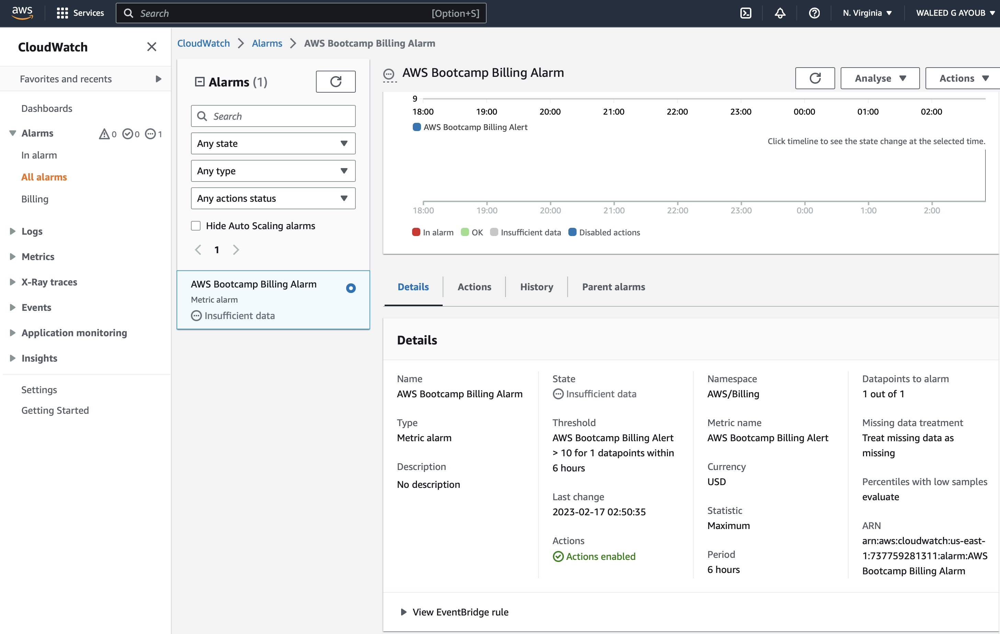
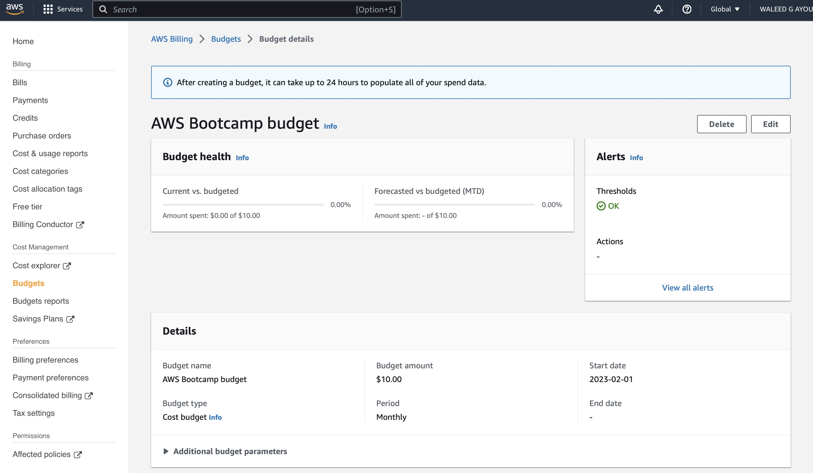

# Week 0 — Billing and Architecture

## Homework Checklist:

### Watched Week 0 - Live Streamed Video
- Done

### Watched Chirag's Week 0 - Spend Considerations
- You can create billing alerts (old model in cloudwatch) or budgets (native in the billing console)
- In the video, we created both but budgets appear to be more flexible and advisable as you can set notifications based on various thresholds
- Budgets can also be set from the global region whereas billing alerts only in N. Virginia
- Cost allocation tags can be used to monitor costs based on tags
- AWS calculator uses a 730 hour month for estimated costs
- You get 2 free budgets, any new budgets are $1

### Watched Ashish's Week 0 - Security Considerations
- Done

### Recreate conceptual diagram in lucidchart.app or on a napkin

- Conceptual diagram can be found here: https://lucid.app/lucidchart/277024ec-bcb5-4a80-8ff9-c5c8fb53e31e/edit?viewport_loc=-535%2C-716%2C2801%2C1965%2C0_0&invitationId=inv_4825e6ca-a826-4f3d-a583-627bf5bd30f9

### Recreate logical architectural diagram in lucidchart.app

### Create an Admin User
- Done

### Use CloudShell

### Generate AWS Credentials

### Installed AWS CLI

### Create a Billing Alarm
- Screenshot of billing alarm:

### Create a Budget
- Screenshot of budget:

## Homework Challenges
### Destroy your root account credentials, Set MFA, IAM role

### Use EventBridge to hookup Health Dashboard to SNS and send notification when there is a service health issue.

### Review all the questions of each pillars in the Well Architected Tool (No specialized lens)

### Create an architectural diagram (to the best of your ability) the CI/CD logical pipeline in Lucid Charts

### Research the technical and service limits of specific services and how they could impact the technical path for technical flexibility. 

### Open a support ticket and request a service limit

## Knowledge Challenges

### Security Quiz

### Pricing Quiz