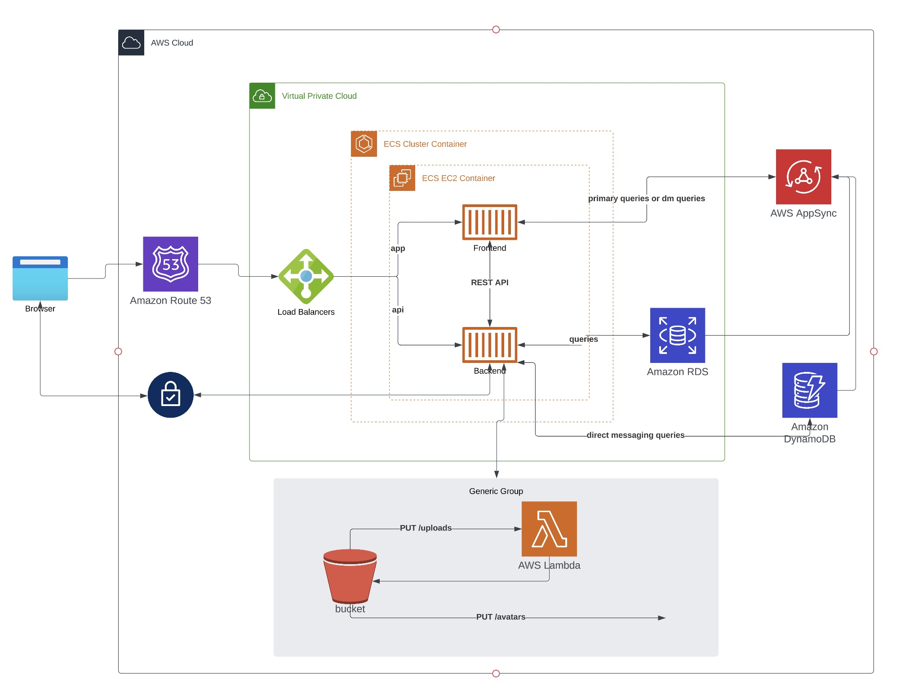

# Week 0 — Billing and Architecture

- NB.: I'll be putting notes as I learn in the respective sections organized by to do lists and homework, etc.

## Homework Checklist:

### Watched Week 0 - Live Streamed Video
- Installed all the pre-requisites and created a repo based on the cruddur template
- Url to my github repo is here: https://github.com/waleedayoub/aws-bootcamp-cruddur-2023
- The pre-reqs I installed or created accounts on are:
    - Gitpod.io: https://gitpod.io/workspaces
        - Signed up with github SSO
    - Honeycomb.io: https://ui.honeycomb.io/waleed-personal/environments/test/send-data
        - Signed up with google SSO
    - Lucidapp
    - Enabled github codespaces (as an alternative to gitpod)
    - Updated my AWS account and went through all the steps (below) to create a new IAM user, etc.
    - Momento: 
    - I already have a bunch of custom domain names registered through dreamhost.com
        - I'll be using mytrellis.club for this course
    - Rollbar: https://app.rollbar.com/a/waleed.ayoub
        - Signed up with github SSO
- 

### Watched Chirag's Week 0 - Spend Considerations
- You can create billing alerts (old model in cloudwatch) or budgets (native in the billing console)
- In the video, we created both but budgets appear to be more flexible and advisable as you can set notifications based on various thresholds
- Budgets can also be set from the global region whereas billing alerts only in N. Virginia
- Cost allocation tags can be used to monitor costs based on tags
- AWS calculator uses a 730 hour month for estimated costs
- You get 2 free budgets, any new budgets are $1

### Watched Ashish's Week 0 - Security Considerations
- Done

### Recreate conceptual diagram in lucidchart.app or on a napkin

- Conceptual diagram can be found here: https://lucid.app/lucidchart/277024ec-bcb5-4a80-8ff9-c5c8fb53e31e/edit?viewport_loc=-535%2C-716%2C2801%2C1965%2C0_0&invitationId=inv_4825e6ca-a826-4f3d-a583-627bf5bd30f9

### Recreate logical architectural diagram in lucidchart.app
- Logical diagram can be found here: https://lucid.app/lucidchart/277024ec-bcb5-4a80-8ff9-c5c8fb53e31e/edit?viewport_loc=-492%2C-103%2C2379%2C1669%2Cd.bycINh20TB&invitationId=inv_4825e6ca-a826-4f3d-a583-627bf5bd30f9
- Screenshot here: 

### Create an Admin User
- I renamed the alias for the account to make it easier to sign-in
    - alias is aws-bootcamp-waleed
    - console sign in link: https://aws-bootcamp-waleed.signin.aws.amazon.com/console
- I went through and reset the password

### Use CloudShell
- Learned how to launch it from the aws console directly
- Played around with the auto-complete functionality, to turn that on, use:
```shell
aws --cli-auto-complete
```

### Generate AWS Credentials
- Created one set of credentials for the main admin user
- Setting environment variables for AWS credentials in gitpod:
```shell
    export AWS_ACCESS_KEY_ID=""
    export AWS_SECRET_ACCESS_KEY=""
    export AWS_DEFAULT_REGION=""
```
- In order to persist these in gitpod's credentials storage, you need to prefix them with `gp env`
```shell    
    gp env AWS_ACCESS_KEY_ID=""
    gp env AWS_SECRET_ACCESS_KEY=""
    gp env AWS_DEFAULT_REGION=""
```
### Installed AWS CLI
- AWS cli installed in both github and locally
- In order to ensure aws cli is available every time I use the gitpod workspace, I needed to add a few things to the `.gitpod.yml`:
```yaml
tasks:
  - name: aws-cli
    env:
      AWS_CLI_AUTO_PROMPT: on-partial
    init: |
      cd /workspace
      curl "https://awscli.amazonaws.com/awscli-exe-linux-x86_64.zip" -o "awscliv2.zip"
      unzip awscliv2.zip
      sudo ./aws/install
      cd $THEIA_WORKSPACE_ROOT
```
- In the above snippet, a few things:
    - I can set the auto prompt to be partial
    - It's just ensuring it downloads the cli and installs it
    - The last line changes directory to the workspace based on an environment variable VS code uses

- In order to get the Account_ID for my AWS account, I can use the following: `aws sts get-caller-identity --query Account --output text`
- And then if I want to put this into an environment variable, I just add export and a $ sign:
```shell
export AWS_ACCOUNT_ID=$(aws sts get-caller-identity --query Account --output text
```
- And then if I want gitpod to remember it, I just pass the `gp env` command

### Create a Billing Alarm
- Screenshot of billing alarm:


### Create a Budget
- Screenshot of budget:


## Homework Challenges
### Destroy your root account credentials, Set MFA, IAM role

### Use EventBridge to hookup Health Dashboard to SNS and send notification when there is a service health issue.

### Review all the questions of each pillars in the Well Architected Tool (No specialized lens)

### Create an architectural diagram (to the best of your ability) the CI/CD logical pipeline in Lucid Charts

### Research the technical and service limits of specific services and how they could impact the technical path for technical flexibility. 

### Open a support ticket and request a service limit

## Knowledge Challenges

### Security Quiz

### Pricing Quiz