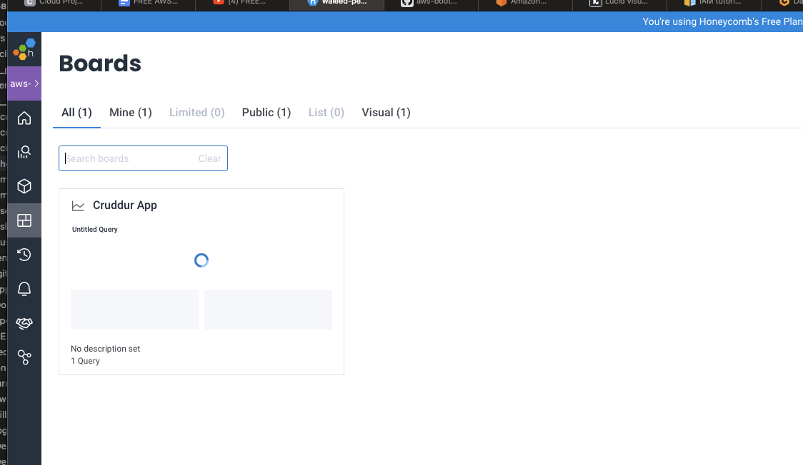

# Week 2 — Distributed Tracing

## Homework Checklist

### Watch Week 2 Live-Stream Video
- Done

### Watch Chirag Week 2 - Spending Considerations (Coming Soon)
- Done

### Watched Ashish's Week 2 - Observability Security Considerations
- Done

### Instrument Honeycomb with OTEL
- I did this, see notes below
- I also went ahead and implemented a custom span for the notification service since I was creating that as I went along

### Instrument AWS X-Ray
- Didn't get to this. Will catch up later

### Configure custom logger to send to CloudWatch Logs
- Didn't get to this, will catch up later

### Integrate Rollbar and capture and error
- Didn't get to this, will catch up later

## Homework Challenges
### Instrument Honeycomb for the frontend-application to observe network latency between frontend and backend[HARD]
- Didn't get to this, will catch up later

### Add custom instrumentation to Honeycomb to add more attributes eg. UserId, Add a custom span
- I did this for the notification service and it seems to be working when I check my honeycomb dashboard

### Run custom queries in Honeycomb and save them later eg. Latency by UserID, Recent Traces
- I created a honeycomb dashboard to monitor both the home activities and the notification services



### 

## Notes

- In order to get honeycomb to receive data from the backend, I had to hard code the API key in the docker-compose
- For some reason, even though it was set in my gitpod environment:
```shell
gitpod /workspace/aws-bootcamp-cruddur-2023 (main) $ env | grep HONEYCOMB
HONEYCOMB_API_KEY=WcriyNaMANM2VIOU9K2IrB
```
- It wasn't actually being picked up when docker-compose ran with this environment variable:
```docker
OTEL_EXPORTER_OTLP_HEADERS: "x-honeycomb-team=${HONEYCOMB_API_KEY}"
```

- In reading other people's comments in youtube, it looks like restarting the gitpod environment fixes that issue above for some reason