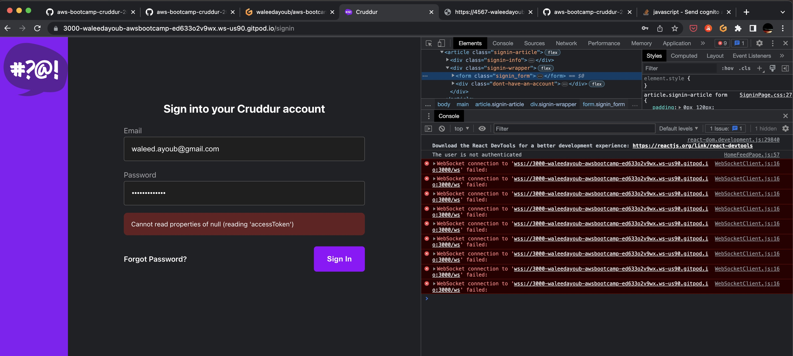

# Week 3 — Decentralized Authentication

## Homeowork checklist
### Watched Ashish's Week 3 - Decenteralized Authentication
### Watch Chirag Week 3 - Spending Considerations (Not yet posted)
### Setup Cognito User Pool
- Done, did this during the weekly live stream

### Implement Custom Signin Page
- Started doing this during the weekly live stream but hit some issues
- Here's the error I get:

- By following the instructions in the youtube video, I ran the below and switched the user to Confirmed!
```shell
> aws cognito-idp admin-set-user-password --username cruddur-test --password XXXX --user-pool-id ca-central-1_xLaE4nSIV --permanent
```
- And it worked!!! I'm logged in

### Implement Custom Signup Page
- Done

### Implement Custom Confirmation Page
- Done

### Implement Custom Recovery Page
- Done

### Verify JWT token server side
- Implementing the back-end portion of the access tokens
- The point of this step is to protect our back end APIs using the same access pattern we implemented for the front end
- In the [Sign in page](../frontend-react-js/src/pages/SigninPage.js), we store our access token in local storage like this:
```js
localStorage.setItem("access_token", user.signInUserSession.accessToken.jwtToken)
```
- Now we need to use that access token to protect our API endpoints
- So in our [Home feed page](../frontend-react-js/src/pages/HomeFeedPage.js) we are passing the endpoint from our back-end like this:
```js
const backend_url = `${process.env.REACT_APP_BACKEND_URL}/api/activities/home`
```
- So it took a while for me to follow along but I finally managed to get it to work ... sort of
- I had to do a couple of things to make mine work:
1. I needed the try section of the data_home() function to return something:
```py
@app.route("/api/activities/home", methods=["GET"])
def data_home():
  access_token = extract_access_token(request.headers)
  try:
    claims = cognito_jwt_token.verify(access_token)
    # authenicatied request
    app.logger.debug("authenicated")
    app.logger.debug(claims)
    app.logger.debug(claims['username'])
    data = HomeActivities.run(cognito_user_id=claims['username'])
    return data, 200
  except TokenVerifyError as e:
    # unauthenicatied request
    app.logger.debug(e)
    app.logger.debug("unauthenicated")
    data = HomeActivities.run()
    return data, 200
```
and;
2. I'm getting a weird error in my inspect page on the actual website:
```js
CognitoUser {username: '3644ca83-bbf8-4f58-a6a8-94adde68c691', pool: CognitoUserPool, Session: null, client: Client, signInUserSession: CognitoUserSession, …}
react-dom.development.js:86 Warning: Encountered two children with the same key, `248959df-3079-4947-b847-9e0892d1bab4`. Keys should be unique so that components maintain their identity across updates. Non-unique keys may cause children to be duplicated and/or omitted — the behavior is unsupported and could change in a future version.
```
- Although I think I know what's wrong with 2. The uuid is set the same for the stub we're adding in
- Anyway, I'm calling this week done and moving on

### Watch about different approaches to verifying JWTs 

## Homework challenges
### [Medium] Decouple the JWT verify from the application code by writing a  Flask Middleware
### [Hard] Decouple the JWT verify by implementing a Container Sidecar ### pattern using AWS’s official Aws-jwt-verify.js library
### [Hard] Decouple the JWT verify process by using Envoy as a sidecar ### https://www.envoyproxy.io/
### [Hard]  Implement a IdP login eg. Login with Amazon or Facebook or Apple.
### [Easy] Implement MFA that send an SMS (text message), warning this has ### spend, investigate spend before considering, text messages are not ### eligible for AWS Credits


## Notes from lecture

### Step 1
- Create a user pool in AWS Cognito
- We did this through the AWS console UI

### Step 2
- Install AWS Amplify:
    - Amplify is a low-code/no-code platform that allows you to build serverless applications
    - It's an SDK that installs a bunch of libraries
    - It's also a way for provisioning back-end resources (including auth)
        - We don't need this since we're using Cognito manually / separately for authentication
    - Amplify is like Firebase in GCP but don't work the same way

- Install amplify in the front-end directory since we're only going to be using amplify for our front end app:
```npm i aws-amplify --save```
- The ```--save``` puts it in our ```frontend-react-js/package.json``` directory as a dependency

### Step 3: 
- Next step is to configure amplify
- This is done by putting a bunch of code in the ```frontend-react-js/src/App.js```
- This is the list of env vars we need to populate in our docker-compose:
```shell
REACT_APP_AWS_PROJECT_REGION
REACT_APP_AWS_COGNITO_IDENTITY_POOL_ID: We don't need this
REACT_APP_AWS_COGNITO_REGION
REACT_APP_AWS_USER_POOLS_ID: We get this one from our AWS Cognito portal and is created when we create a user pool
REACT_APP_CLIENT_ID: Similar to the above, we get this when we create an app in AWS Cognito
```

### Step 4:
- Conditionally show stuff when user logged in vs not logged in